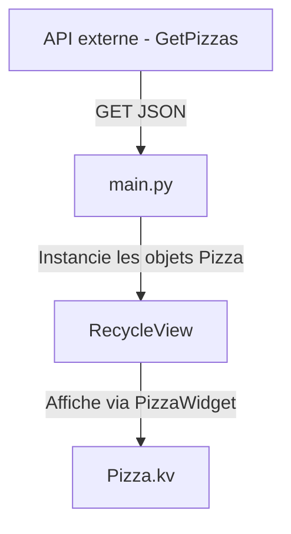

# **🍕 Application Pizza - Documentation du Projet**

**Une interface de sélection de pizzas dynamique**, développée avec **Python 3.10.11** et **Kivy**, utilisant un **RecycleView** pour des performances optimales. Les données sont désormais récupérées dynamiquement depuis une **API externe**.

---

## **📦 Structure du Projet**

```
.
├── main.py          # Logique principale et contrôleur
├── models.py        # Modèle de données (classe Pizza)
└── Pizza.kv         # Interface utilisateur (langage Kivy)
```

---

## Fonctionnalités

-  **Liste dynamique de pizzas** – Affichage fluide grâce à RecycleView.
-  **Terminologie française** – Variables en français (`nom`, `prix`, `vegetarienne`).
-  **Connexion à une API** – Récupération des données via une requête HTTP GET depuis le site du projet Django PizzaMama.
-  **Architecture propre (MVC)** – Séparation des responsabilités claire.

---

## **📂 Aperçu du Code**

### **1. Modèle de Données (`models.py`)**

```python
class Pizza:
    """Représente une pizza avec son nom, ses ingrédients, son prix et son statut végétarien."""

    def __init__(self, nom, ingredients, prix, vegetarienne):
        self.nom = nom
        self.ingredients = ingredients
        self.prix = prix
        self.vegetarienne = vegetarienne

    def get_dictionary(self):
        """Convertit l'objet Pizza en dictionnaire pour Kivy."""
        return {
            "nom": self.nom,
            "ingredients": self.ingredients,
            "prix": self.prix,
            "vegetarienne": self.vegetarienne
        }
```

---

### **2. Application Principale (`main.py`)**

```python
import requests
from kivy.app import App
from kivy.properties import ObjectProperty, StringProperty, NumericProperty, BooleanProperty
from kivy.uix.boxlayout import BoxLayout
from kivy.uix.floatlayout import FloatLayout
from models import Pizza

class PizzaWidget(BoxLayout):
    nom = StringProperty()
    ingredients = StringProperty()
    prix = NumericProperty()
    vegetarienne = BooleanProperty()

class MainWidget(FloatLayout):
    recycleView = ObjectProperty(None)

    def __init__(self, **kwargs):
        super().__init__(**kwargs)
        self.pizzas = []
        self.load_pizzas_from_api()

    def load_pizzas_from_api(self):
        """Charge les données de pizzas depuis l'API distante."""
        url = "https://fabricedeveloper.pythonanywhere.com/api/GetPizzas"
        try:
            response = requests.get(url)
            data = response.json()
            self.pizzas = [
                Pizza(
                    p.get("nom", "Inconnue"),
                    p.get("ingredients", ""),
                    float(p.get("prix", 0)),
                    bool(p.get("vegetarienne", False))
                ) for p in data
            ]
            self.recycleView.data = [p.get_dictionary() for p in self.pizzas]
        except Exception as e:
            print("Erreur lors du chargement des pizzas :", e)

class PizzaApp(App):
    pass

if __name__ == '__main__':
    PizzaApp().run()
```

---

### **3. Interface Utilisateur (`Pizza.kv`)**

```kv
MainWidget:

<MainWidget>:
    BoxLayout:
        orientation: "vertical"
        spacing: 20

        Image:
            source: "images/small_logo.png"
            size_hint: None, None
            size: 150, 60
            pos_hint: {"center_x": 0.5}

        Label:
            text: "Les Pizzas"
            font_size: 22
            bold: True

        RecycleView:
            id: recycleView
            viewclass: "PizzaWidget"
            RecycleBoxLayout:
                default_size: None, 56
                size_hint_y: None
                height: self.minimum_height
                orientation: "vertical"
                spacing: 16

<PizzaWidget>:
    BoxLayout:
        spacing: 10
        Label:
            text: root.nom
            font_size: 22
        Label:
            text: root.ingredients
        Label:
            text: f"{root.prix}€"
        Label:
            text: "VÉGÉTARIENNE" if root.vegetarienne else ""
```

---

## 🔄 Flux de Données



---

## **⚙️ Installation & Exécution**

### Prérequis

* Python **3.10.11**
* Connexion Internet pour accéder à l’API

---

### Étapes d'installation

1. **Créer un dossier de projet**

   ```bash
   mkdir kivy-pizza-v2
   cd kivy-pizza-v2
   ```

2. **Mettre à jour les outils Python**

   ```bash
   python -m pip install --upgrade pip setuptools virtualenv
   ```

3. **Créer un environnement virtuel**

   ```bash
   python -m venv kivy_venv
   ```

4. **Activer l’environnement virtuel**

   * **Windows (CMD)** :

     ```bash
     kivy_venv\Scripts\activate
     ```
   * **Windows (bash)** :

     ```bash
     source kivy_venv/Scripts/activate
     ```
   * **Linux/macOS** :

     ```bash
     source kivy_venv/bin/activate
     ```

5. **Installer les dépendances**

   ```bash
   python -m pip install "kivy[base]" kivy_examples requests
   ```

6. **Placer les fichiers dans le dossier**

   * `main.py`, `models.py`, `Pizza.kv`
   * Ajouter aussi le dossier `images/` contenant `small_logo.png` si utilisé

7. **Lancer l'application**

   ```bash
   python main.py
   ```

---

## ✅ Points Clés

* **Séparation claire** entre modèle, logique et interface.
* **Défilement fluide** grâce à RecycleView.
* **Connexion dynamique** aux données via une API REST.
* **Code francisé** pour accessibilité et clarté.

---

##  Améliorations possibles à venir

* [ ] Ajout d'un panier d’achat interactif
* [ ] Ajout des filtres (végétariennes uniquement, par prix, etc.)
* [ ] Authentification utilisateur
* [ ] Ajout/modification de pizzas via l’API

