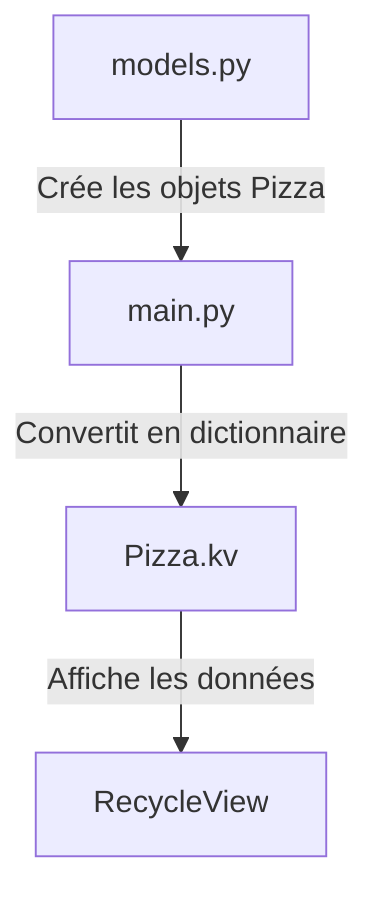

# **Application Pizza - Documentation du Projet**  

**Une interface de sélection de pizzas dynamique**, développée avec Python et Kivy, utilisant un **RecycleView** pour des performances optimales.  

---

## **📦 Structure du Projet**  
```
.
├── main.py          # Logique principale et contrôleur
├── models.py        # Modèle de données (classe Pizza)
└── Pizza.kv      # Interface utilisateur (langage Kivy)
```  

---

## ** Fonctionnalités**  
- **Liste dynamique de pizzas** – Affichage fluide avec chargement optimisé.  
- **Terminologie française** – Utilisation de variables en français (`nom`, `prix`, `vegetarienne`).  
- **Performance optimisée** – Grâce à `RecycleView` pour le défilement.  
- **Architecture propre** – Respecte le modèle MVC.  

---

## **📂 Aperçu du Code**  

### **1. Modèle de Données (`models.py`)**  
Définit la classe `Pizza` avec des attributs en français.  856280

```python
class Pizza:
    """Représente une pizza avec son nom, ses ingrédients, son prix et son statut végétarien."""

    def __init__(self, nom, ingredients, prix, vegetarienne):
        self.nom = nom
        self.ingredients = ingredients
        self.prix = prix
        self.vegetarienne = vegetarienne

    def get_dictionary(self):
        """Convertit l'objet Pizza en dictionnaire pour Kivy."""
        return {
            "nom": self.nom,
            "ingredients": self.ingredients,
            "prix": self.prix,
            "vegetarienne": self.vegetarienne
        }
```  

---

### **2. Application Principale (`main.py`)**  
Gère l'initialisation des données et la liaison avec l'interface.  

```python
from kivy.app import App
from kivy.properties import ObjectProperty, StringProperty, NumericProperty, BooleanProperty
from kivy.uix.boxlayout import BoxLayout
from kivy.uix.floatlayout import FloatLayout
from models import Pizza

class PizzaWidget(BoxLayout):
    """Widget personnalisé pour afficher une pizza."""
    nom = StringProperty()          # Nom de la pizza (lié au KV)
    ingredients = StringProperty()  # Ingrédients
    prix = NumericProperty()        # Prix (nombre)
    vegetarienne = BooleanProperty() # Statut végétarien

class MainWidget(FloatLayout):
    """Conteneur principal avec la logique de la liste de pizzas."""
    recycleView = ObjectProperty(None)  # Lié au RecycleView dans le KV

    def __init__(self, **kwargs):
        super().__init__(**kwargs)
        # Données de pizzas (exemple)
        self.pizzas = [
            Pizza("4 fromages", "chèvre, emmental, brie, comté", 9.5, True),
            Pizza("Chorizo", "tomates, chorizo, parmesan", 11.2, False),
            Pizza("Calzone", "fromage, jambon, champignons", 10, False)
        ]

    def on_parent(self, widget, parent):
        """Remplit le RecycleView avec les données des pizzas."""
        self.recycleView.data = [p.get_dictionary() for p in self.pizzas]

class PizzaApp(App):
    """Classe principale de l'application Kivy."""
    pass  # L'interface est chargée automatiquement depuis le fichier KV

if __name__ == '__main__':
    PizzaApp().run()
```  

---

### **3. Interface Utilisateur (`pizzascr.kv`)**  
Définit la mise en page avec le langage Kivy.  

```kv
# Structure du widget principal
MainWidget:

<MainWidget>:
    BoxLayout:
        orientation: "vertical"
        spacing: 20

        # En-tête
        Image:
            source: "images/small_logo.png"
            size_hint: None, None
            size: 150, 60
            pos_hint: {"center_x": 0.5}

        Label:
            text: "Les Pizzas"
            font_size: 22
            bold: True

        # Liste de pizzas (RecycleView)
        RecycleView:
            id: recycleView
            viewclass: "PizzaWidget"
            RecycleBoxLayout:
                default_size: None, 56
                size_hint_y: None
                height: self.minimum_height
                orientation: "vertical"
                spacing: 16

<PizzaWidget>:
    BoxLayout:
        spacing: 10
        Label:
            text: root.nom  # Lie à PizzaWidget.nom
            font_size: 22
        Label:
            text: root.ingredients
        Label:
            text: f"{root.prix}€"
        Label:
            text: "VÉGÉTARIENNE" if root.vegetarienne else ""
```  

---

##  Flux de Données  



1. **Initialisation des données** (`models.py` → `main.py`)  
   - Les pizzas sont créées dans `models.py`.  
   - Converties en dictionnaires via `get_dictionary()`.  

2. **Liaison avec l'interface** (`main.py` → `Pizza.kv`)  
   - `MainWidget` envoie les données au `RecycleView`.  
   - Le fichier KV affiche chaque élément avec `PizzaWidget`.  

3. **Affichage** (`RecycleView`)  
   - Optimisé pour ne rendre que les éléments visibles.  

---

## **⚙️ Installation & Exécution**  

1. **Installer Kivy**  
   ```bash
   pip install kivy
   ```  

2. **Lancer l'application**  
   ```bash
   python main.py
   ```  

---

## Points Clés  
✅ **Séparation des responsabilités** – Données, logique et UI clairement distinctes.  
✅ **Performance optimisée** – `RecycleView` garantit un défilement fluide.  
✅ **Localisation en français** – Variables et interface adaptées.  

--- 

**Améliorations Possibles**  
- Charger les pizzas depuis un fichier JSON ou une API.  
- Ajouter un panier d'achat.  
- Implémenter une authentification utilisateur.  

